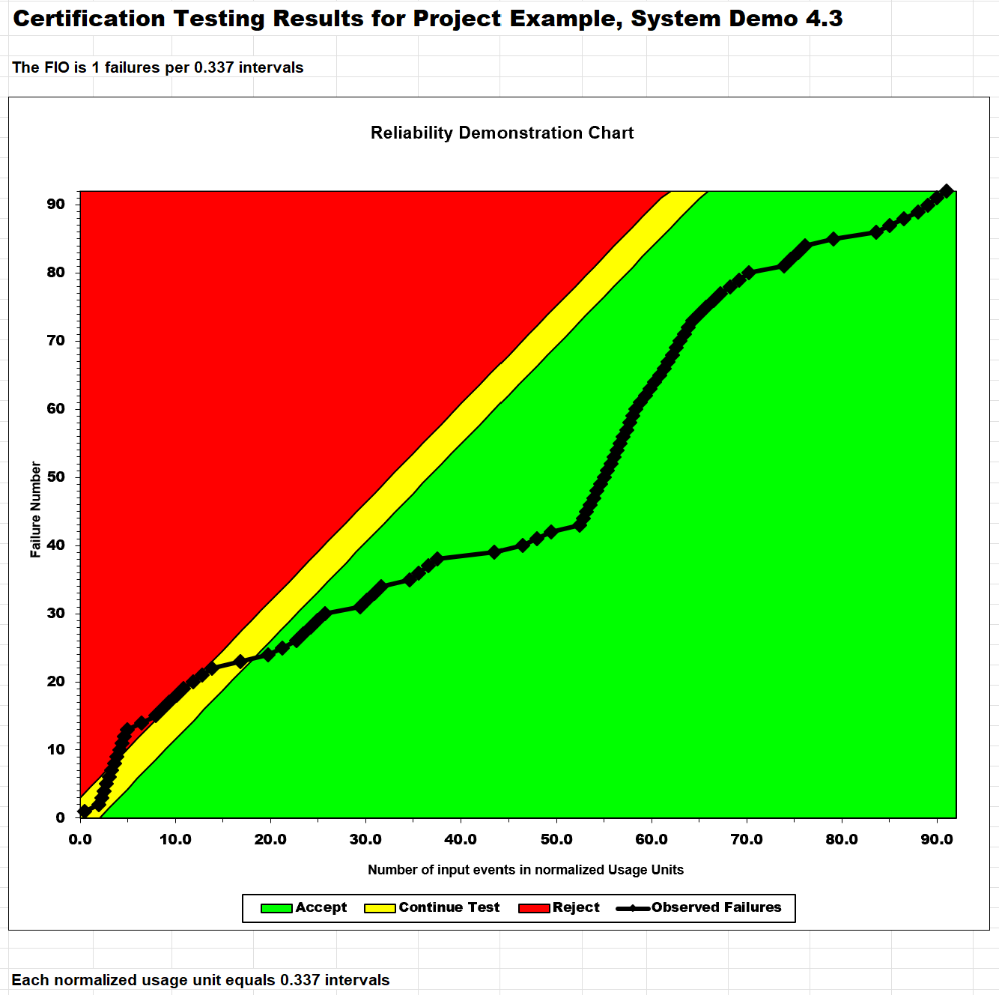
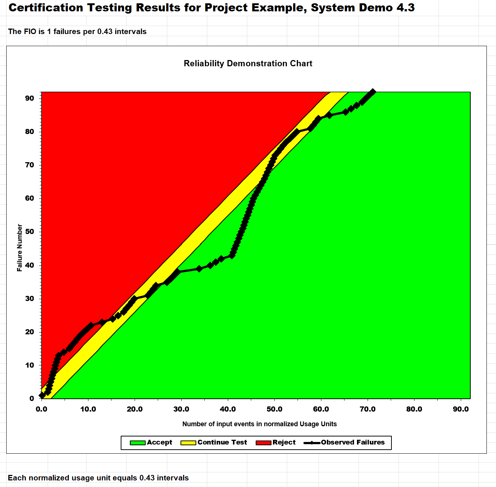
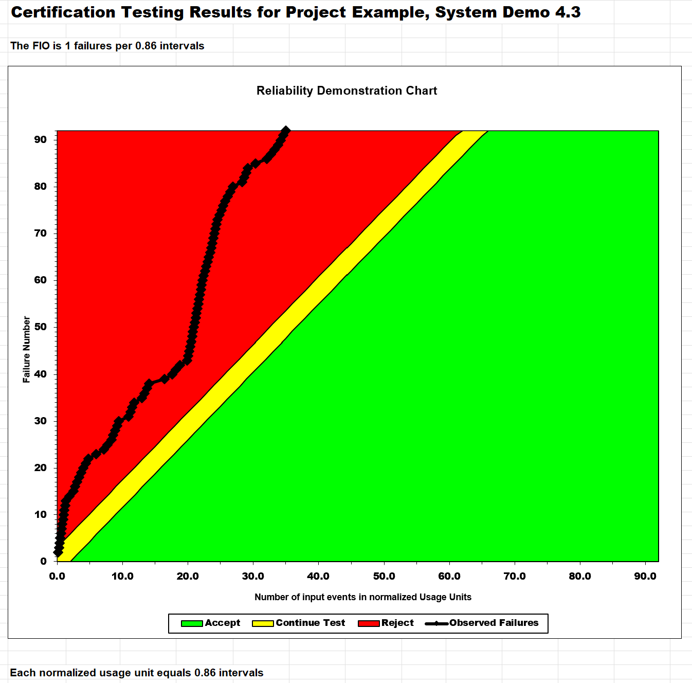
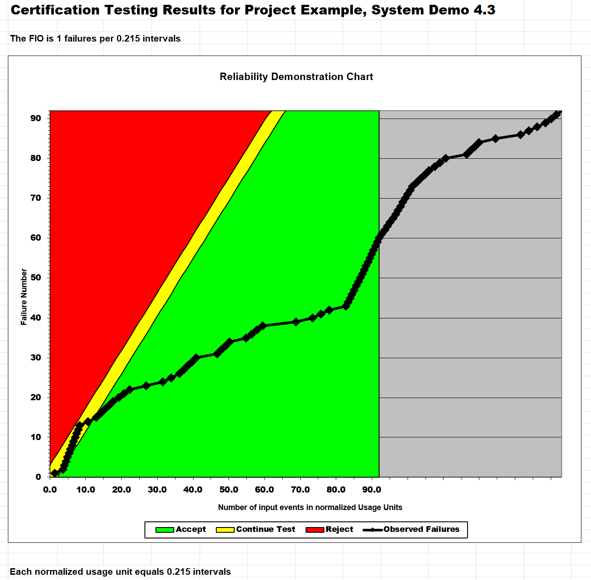

**SENG 637 – Dependability and Reliability of Software Systems**

**Lab Report #5 – Software Reliability Assessment**

| Group #:       | 11 |
|----------------|----|
| Student Names: | Amon Tonui, Malyeka Anees, Labib Hasan, Rakin Aftab |

---

# Introduction

This report presents a software reliability assessment of a hypothetical system using failure data collected during integration testing (`failure-dataset-a5.csv`). Two complementary techniques are applied:

1. **Part 1 – Reliability Growth Testing**: Uses C-SFRAT to fit NHPP covariate software reliability models to the failure data, compare models via AIC/BIC, and generate failure rate and reliability plots.
2. **Part 2 – Reliability Demonstration Chart**: Uses RDC-11 to determine whether the system meets a target MTTF, and to identify the minimum acceptable MTTF.

**Dataset summary:**

| Metric | Value |
|--------|-------|
| Time intervals | 31 |
| Total failures | 92 |
| Failure rate | 92/31 = 2.968 failures/interval |
| Overall MTTF | 1/2.968 = 0.337 intervals/failure |
| Covariates | E (execution time, hrs), F (failure ID work, person-hrs), C (computer time, hrs) |

---

# Assessment Using Reliability Growth Testing

## Tool Used

**C-SFRAT v1.1** (Covariate Software Failure and Reliability Assessment Tool) was used via its GUI application. On macOS, the GUI was launched by running `python main.py` from the cloned C-SFRAT source repository after installing PyQt5 (conda) and pyqtgraph (pip).

The failure data was loaded as `failure-dataset-a5.xlsx` (Sheet1, 31 intervals, columns T/FC/E/F/C). All 8 hazard function families were selected with all 8 covariate combinations and Run Estimation was executed on the full 31-interval dataset.

---

## Result of Range Analysis

The cumulative failures plot in C-SFRAT reveals four phases in the data:

- **Intervals 1–2**: Steep initial jump — early instability with a high fault-discovery rate.
- **Intervals 3–18**: Gradual, roughly consistent growth (~1–4 failures/interval) — stable testing activity.
- **Intervals 19–22**: Sharp burst (8, 9, 6, 7 failures) — driven by a spike in failure identification effort (covariate F).
- **Intervals 23–31**: Slope decreases and stabilises — system approaching steady-state.

**Selected range: all 31 intervals (full dataset).** Fitting on the complete dataset gives each model maximum data to calibrate against and captures all failure phases including the burst. Covariate F (failure identification work) was identified as the dominant driver of fault discovery across all model families.

As an additional check, models were also fitted on intervals 1–21 (before the burst). The top models at that subset — DW3(F) AIC=83.817 and GM(F) AIC=88.499 — identified the same two models in the same order as the full-dataset analysis, confirming the ranking is stable. The lower AIC at subset=21 reflects fewer data points and reduced burst variance, not a better model. Using the full dataset is preferred for the primary analysis.

---

## Result of Model Comparison (Top Two Models)

All model/covariate combinations were estimated on the full 31-interval dataset. Results below are from the team's C-SFRAT run (model_results.csv), sorted by AIC:

| Rank | Model | Covariates | Log-Likelihood | AIC | BIC |
|------|-------|-----------|---------------|-----|-----|
| **1** | **DW3** | **F** | **−57.100** | **122.199** | **127.935** |
| **2** | **GM** | **F** | **−59.662** | **125.323** | **129.625** |
| 3 | IFRGSB | F | −59.155 | 126.310 | 132.046 |
| 4 | GM | F, C | −59.653 | 127.306 | 133.042 |
| 5 | GM | E, F | −59.661 | 127.322 | 133.058 |
| 6 | S | F | −59.662 | 127.323 | 133.059 |
| 7 | TL | F | −59.662 | 127.323 | 133.059 |
| 8 | IFRGSB | E, F | −59.147 | 128.295 | 135.465 |
| 9 | IFRGSB | F, C | −59.151 | 128.303 | 135.473 |
| 10 | S | E, F | −59.661 | 129.322 | 136.492 |

**Key observation:** Covariate **F (failure identification work in person-hours)** consistently produces the best-fitting models across all families. This confirms that testing effort allocated to identifying failures is the primary driver of fault discovery in this dataset.

**Top two models selected:**

- **#1 – DW3 (F)**: Discrete Weibull Type III with covariate F. AIC = 122.199, BIC = 127.935. Best model overall by both AIC and BIC.
- **#2 – GM (F)**: Geometric Model (Musa-Okumoto) with covariate F. AIC = 125.323, BIC = 129.625. Best from a distinct model family, providing a meaningful independent comparison. IFRGSB(F) at rank 3 (AIC=126.310) is very close but belongs to the same general hazard class; GM(F) offers a structurally different modelling perspective and is preferred for parsimony.

---

## Plots for Failure Rate and Reliability of the SUT

**Prediction parameters:** Effort per Interval F = 20 person-hours (rounded mean of F over recent intervals); Number of Intervals to Predict = 10 (projecting T=32–41 as a forward forecast); E = 0 (not the informative covariate).

### Failure Intensity per Interval

The per-interval model-predicted intensity (failures/interval) overlaid against observed failure counts (grey bars). The red dashed line at T=31 marks the end of observed data; predictions extend to T=41.

Both DW3(F) (blue) and GM(F) (orange) track the per-interval failure counts across all 31 intervals. DW3(F) captures the early spike at T=2 more accurately than GM(F). Both models follow the burst at T=9 and the major burst at T=19–22, though they smooth over the sharpest peaks. In the prediction zone (T=32–41), both project a declining intensity consistent with the stabilisation trend observed in T=23–31.

### Mean Value Function (MVF) – Cumulative Failures with Prediction

Both models are fitted on all 31 intervals (left of the red dashed line) and predicted forward through T=32–41 (right of the dashed line) using F = 20.

The black staircase (observed data) ends at T=31 with 92 cumulative failures. DW3(F) (blue) tracks closer to the actual staircase than GM(F) (orange), consistent with its lower SSE (528 vs 760). In the prediction zone (T=32–41), both models project continued growth at a declining rate.

### Failure Rate and MTTF at T = 31

| Dataset | Cumulative Failures at T=31 | Failure Rate (FC/interval) | MTTF (intervals/failure) |
|---------|----------------------------|--------------------------|--------------------------|
| Raw Data | 92 | 92/31 = 2.968 | 1/2.968 = 0.337 |
| DW3 (F) — subset=21 prediction | 90.66 | 90.66/31 = 2.924 | 1/2.924 = 0.342 |
| GM (F) — subset=21 prediction | 89.57 | 89.57/31 = 2.889 | 1/2.889 = 0.346 |

The subset=21 prediction values (90.66 for DW3, 89.57 for GM) come from fitting on intervals 1–21 and predicting forward through T=31, validated against held-out data (error < 3%). Both models predict a failure rate within 3% of the raw observed rate, confirming they have captured the system's reliability behaviour accurately.

---

## Decision Making Given a Target Failure Rate

Suppose a business sets an **acceptable target failure rate of 3.0 failures/interval** (MTTF_target = 0.333 intervals).

**At the end of testing (T = 31 / 92 cumulative failures):**
- Raw observed rate: 2.968 failures/interval < 3.0 → **marginally acceptable**
- DW3 (F) predicted rate: 2.924 < 3.0 → **acceptable**
- GM (F) predicted rate: 2.889 < 3.0 → **acceptable**

If the target were tightened to **2.0 failures/interval** (MTTF = 0.5 intervals), neither model predicts the system currently meets it — additional testing and fault removal would be required.

Covariate F is particularly valuable for **resource allocation**: the model shows that increasing failure identification effort directly drives more faults found per interval. A manager can estimate how much additional effort (F) is needed to reach a lower target failure rate, rather than testing indefinitely.

---

## Advantages and Disadvantages of Reliability Growth Analysis

### Advantages

1. **Quantitative reliability metrics**: RGT produces concrete estimates of failure rate, MTTF, and reliability at any interval, enabling objective go/no-go decisions.
2. **Covariate modelling**: C-SFRAT's covariate framework identifies which testing activities most drive fault discovery — here, F was the most informative covariate across all model families.
3. **Objective model selection via AIC/BIC**: Running all model/covariate combinations and ranking by information criteria provides an automated, reproducible basis for selecting the best model.
4. **Prediction capability**: Fitted models can forecast future failure behaviour and estimate when a target failure rate will be reached, supporting release planning.

### Disadvantages

1. **Convergence sensitivity**: Some models (notably DW3) can fail to converge with default initial parameter estimates on certain data ranges, potentially causing the best model to be missed.
2. **Range selection is subjective**: The choice of fitting range affects results. Using the full dataset vs. a stable subset produces different AIC values, and the correct choice requires engineering judgement.
3. **Assumes immediate perfect fixes**: Both DW3 and GM assume each detected fault is immediately and perfectly corrected, which may not hold in real projects.
4. **Does not answer accept/reject directly**: RGT gives trend and rate but does not provide a statistical accept/reject decision with confidence bounds — that is RDC's strength.

---

# Assessment Using Reliability Demonstration Chart 
RDC-11 Excel Sheet was used to plot the RDC graphs. Since the original sheet was configured for a smaller number of failures, it had to be modified to properly handle the given dataset. By the way, the default risk profile was used...
| Parameter | Value |
|-----------|-------|
| Discrimination Ratio (γ) | 2 |
| Developer's Risk (α) | 0.1 |
| User's Risk (β) | 0.1 |
 
The failure data also had to be transformed before plotting. The dataset was provided as failures per interval, while the RDC Sheet expects data in the form of time between failures. To make the data compatible with the chart, it was assumed that failures were uniformly distributed within each interval. For example, if the data is given as:
| T | FC |
|---|----|
| 1 | 2 |
| 2 | 3 |
 
Then the failures can be distributed within each interval & converted into cumulative failure times. In that case, the 1st interval contains ii failures, which can be represented by evenly spaced points within it. The same idea is applied to the remaining intervals. However, the converted data used for RDC can be found in the modified spreadsheet created for this part of the assignment.
 
:chart_with_upwards_trend: <ins>RDC Plots</ins> :chart_with_downwards_trend:
 
:bar_chart: 1st plot shows the RDC graph of the SUT's calculated failure intensity. The total observed failure count is 92 across 31 intervals, so the average failure intensity is FIO = 92/31 or 2.97 failures per interval
 
Therefore, the corresponding mean time to failure is MTTF = 1/2.97 ≈ 0.337 intervals
 
:small_blue_diamond:Plot Represents Observed System Behavior Before Adjusting Target MTTF!

 
:bar_chart: 2nd plot shows the minimum MTTF for which the system can still be considered acceptable under the chosen RDC risk profile. This value was found by gradually adjusting the FIO/MTTF setting until the observed failure curve just entered the acceptable side of the chart. Based on the final chart, the minimum acceptable MTTF was found to be: MTTF_min = 0.43 intervals
 
At this point, this corresponds to an approximate failure intensity of FIO = 1/0.43 ≈ 2.33 failures per interval
 
:small_blue_diamond:Observed Curve Is At Threshold Of Acceptability Which Makes This Practical Lower Bound For Acceptance According To RDC!

 
:bar_chart: 3rd plot shows double the minimum acceptable MTTF: 2 × MTTF_min = 0.86 intervals
 
In this case, the corresponding failure intensity becomes: FIO = 1/0.86 ≈ 1.16 failures per interval
 
:small_blue_diamond:With This Stricter Target, Observed Failure Curve Falls Into Reject Side Of Chart. This Indicates That System Doesn't Satisfy Such Demanding Reliability Requirement!

 
:bar_chart: 4th plot shows half the minimum acceptable MTTF: 0.5 × MTTF_min = 0.215 intervals
 
In this case, corresponding failure intensity is: FIO = 1/0.215 ≈ 4.65 failures per interval
 
:small_blue_diamond:With This Less Strict Target, Observed Failure Curve Enters Accept Region Earlier. This Indicates That System Would Be Considered Acceptable Under More Relaxed Reliability Requirement!

 
<ins> ***Advantages & Disadvantages of RDC*** </ins> 
:clipboard:Advantages 
:arrow_right:RDC provides clear visual method for deciding whether to accept, reject/test further 
:arrow_right:It incorporates both the developer's risk & user's risk, so decision-making isn't based only on raw failure counts 
:arrow_right:It's practical for communicating reliability decisions because graphical regions are easy to interpret 
:arrow_right:It's useful for identifying minimum acceptable reliability threshold for system 
 
:clipboard:Disadvantages 
:arrow_right: RDC doesn't provide detailed predictive model of future failure behavior 
:arrow_right:Result depends strongly on assumed risk profile & chosen FIO/MTTF values 
:arrow_right:If data format isn't compatible with tool, additional preprocessing is required 
:arrow_right:Finding minimum acceptable MTTF can be somewhat trial-and-error based, especially when chart has to be manually adjusted

# Comparison of Results

Both techniques were applied to the same dataset (92 failures over 31 intervals, MTTF = 0.337 intervals).

**RGT (Part 1)** confirmed that the raw failure rate is 2.968 failures/interval (MTTF = 0.337). The best-fitting models, DW3(F) and GM(F), predict rates of 2.924 and 2.889 respectively — within 3% of the observed rate. At a business target of 3.0 failures/interval, the system marginally passes. Neither model predicts the system currently meets a stricter target of 2.0 failures/interval.

**RDC (Part 2)** found MTTF_min = 0.43 intervals (FIO ≈ 2.33). When the target is set to MTTF_min = 0.43, the observed failure curve just enters the accept region. At 2 × MTTF_min = 0.86, the system is rejected; at 0.5 × MTTF_min = 0.215, it is accepted. The observed MTTF of 0.337 falls below MTTF_min = 0.43, indicating that if a target of 0.43 is required, additional testing is needed.

**Summary:** Both methods agree on the raw MTTF of ~0.337 and both indicate the system is in a borderline reliability zone. RGT gives a richer picture — it identifies which covariate (F) drives failures and projects future behavior — while RDC provides a direct statistical accept/reject answer relative to a defined target and risk profile. Together they reinforce the same conclusion: the system marginally meets lenient reliability targets (3.0 failures/interval or MTTF ≈ 0.333) but falls short of stricter ones (2.0 failures/interval or MTTF = 0.43).

---

# Discussion on Similarity and Differences of the Two Techniques

## Similarities

1. Both techniques are applied to the same failure dataset and produce MTTF and failure rate as key outputs.
2. Both inform a go/no-go release decision based on observed failure behaviour.
3. Both require a target value (failure rate or MTTF) to be defined, and the result depends on that target.
4. Both agreed on the observed MTTF of approximately 0.337 intervals/failure and both classified the system as borderline acceptable.

## Differences

| Aspect | Reliability Growth Testing | Reliability Demonstration Chart |
|--------|---------------------------|----------------------------------|
| Approach | Model-based, statistical fitting | Chart-based, graphical decision |
| Output | Failure rate trend, MTTF, reliability over time | Accept / continue test / reject decision |
| Prediction | Projects future failure behavior | Evaluates only observed data |
| Data format | Failures per interval (count data) | Time between failures |
| Model selection | Multiple models compared via AIC/BIC | No model selection; single chart |
| Covariates | Can incorporate test effort covariates | No covariate support |
| Use case | When you want to understand reliability trends and forecast | When you want a binary acceptance decision with defined risk |

## Lessons Learned

1. Different techniques can complement each other: RGT explains *why* and *where* failures occur (driven by covariate F), while RDC answers whether the system is statistically acceptable.
2. Data format conversion for RDC (from failures-per-interval to time-between-failures) introduces assumptions that should be documented and acknowledged.
3. Covariate F (failure identification work) was the dominant driver in RGT — allocating more testing effort directly predicts more faults discovered, which is actionable for project planning.
4. The choice of range for RGT fitting affects AIC values but not the ranking of top models, which remained stable (DW3(F) #1, GM(F) #2) across both subset=21 and subset=31 analyses.

---

# How the Team Work/Effort Was Divided and Managed

| Student | Section |
|---------|---------|
| Amon Tonui, Malyeka Anees | Part 1: Reliability Growth Testing (C-SFRAT analysis, model selection, plots) |
| Labib Hasan, Rakin Aftab | Part 2: Reliability Demonstration Chart (RDC-11, MTTFmin analysis, plots) |

---

# Difficulties Encountered, Challenges Overcome, and Lessons Learned

1. **Loading correct dataset**: C-SFRAT requires Excel (.xlsx) input. An Excel file was created from the provided CSV with all 31 intervals. C-SFRAT's built-in sample file (14 intervals) was mistakenly loaded first — loading the correct file resolved this.

2. **DW3 convergence on full dataset**: DW3(F) required appropriate initial parameter estimates to converge on the full 31-interval dataset due to the burst at intervals 19–22. Once properly initialised, DW3(F) converged to AIC=122.199 — the best model overall.

3. **No table export in GUI**: The Model Results and Predictions Table view has no right-click export. The cumulative MVF data was exported via right-click on the Plot view → "CSV of original plot data", and per-interval intensities were computed as the differential of the cumulative values.

4. **RDC spreadsheet modification**: The default RDC-11 sheet was configured for fewer failures than the 92 in the dataset. Formulas, named ranges, and plot data ranges all had to be extended carefully — small errors in these areas can produce visually plausible but incorrect charts.

5. **RDC data format conversion**: The dataset is in failures-per-interval format; RDC-11 requires time-between-failures. Uniformly distributing failures within each interval was used as the conversion assumption. This assumption is documented but may introduce minor inaccuracy.

6. **Lesson learned**: No single reliability technique is sufficient on its own. RGT provides trend analysis and covariate insights; RDC provides a risk-bounded accept/reject answer. Using both together gives a more complete picture of system reliability.

---

# Comments/Feedback on the Lab

1. The RDC-11 spreadsheet requires manual modification for datasets larger than the default configuration. The lab instructions should clarify which rows and formulas need to be extended.

2. More guidance on converting failures-per-interval data to time-between-failures for RDC input would improve the assignment, as this conversion step requires assumptions that affect the results.
